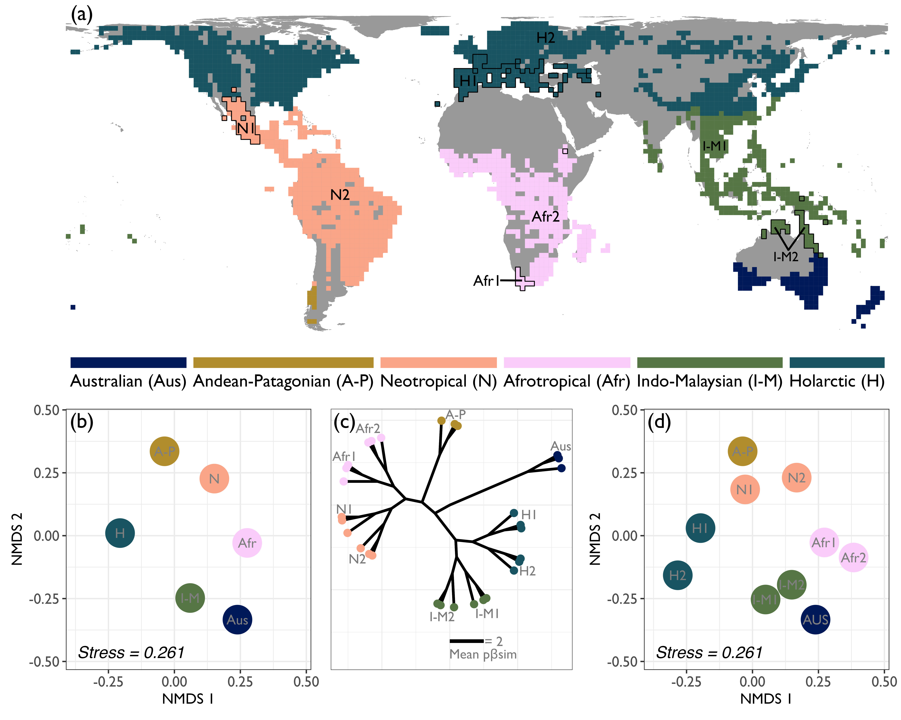

<h1 align="center">A global bioregionalisation for orchids</h1>

  
  

---

This repository contains the R code and workflows for the study **"A global bioregionalisation for orchids"**, published in *New Phytologist*. This work establishes the first hierarchical bioregionalisation system for Orchidaceae at a global scale, integrating large-scale distribution data and phylogenetic relationships.

## 1. Abstract
Bioregionalisation provides a framework for categorising geographic areas based on their biotic composition and evolutionary history. Despite the global significance of orchids, such a system was previously lacking for the family. Using **732,359 distribution records** and a **phylogeny encompassing 19,123 species**, we defined a global bioregionalisation based on **phylogenetic beta diversity** ($p\beta_{sim}$) at a 200 × 200 km resolution. We identified six global realms and ten bioregions, along with four major transition zones. Our results demonstrate that annual precipitation and temperature, together with their seasonality, are the primary drivers of orchid realm formation.

  
   
  <em><b>Fig. 1.</b> Global orchid realms and bioregions identified at a 200 × 200 km resolution.</em>

## 2. Repository Structure (in the scripts folder)
The workflow is organised into seven methodological steps executed in R:

* **`2.1-Data collection.R`**: Compiling occurrence data from public databases (GBIF, RAINBIO, SpeciesLink, and ALA).
* **`2-2-data selection.R`**: Automated geographic cleaning and taxonomic standardisation against the *World Checklist of Vascular Plants* (WCVP) using the `rWCVP` package.
* **`3-Community.matrix.R`**: Rasterisation of records at multiple resolutions, construction of presence-absence matrices (PAMs), and calculation of $p\beta_{sim}$ averaged across 100 random tree topologies.
* **`4-Data exploration.R`**: Evaluation of sampling effort using species accumulation curves (KnowBR) to assess the reliability of the bioregional patterns and patters of phylogenetic beta diversity
*  **`5-Building regionalisation.R`**: Implementation of hierarchical clustering algorithms (UPGMA) to create bioregionalisaion at 200 x 200 km. 
* **`5.1-evaluation_grain-size.R`**: Implementation of hierarchical clustering algorithms (UPGMA) and silhouette analysis to determine the optimal spatial resolution and delimit realms and bioregions.
* * **`6-relationship.R`**: We identified transition zones between orchid realms and quantified fundamental aspects of species distribution for each realm: total species richness, endemic species, and genera indicator.
* **`7-drivers_analysis.R`**: Assessing the influence of climate (CHELSA) and topography on phylogenetic dissimilarity using environmental distance and OLS modelS.

## 3. Key Findings

* **Realms and Bioregions**: We identified **six global realms**: Australian, Andean-Patagonian, Neotropical, Afrotropical, Indo-Malayan, and Holarctic, subdivided into **ten bioregions**.
* **Transition Zones**: Four main transition zones were identified (Mexican, South American, Northern Australian, and Chinese), where biotic components overlap.
* **Drivers of Regionalisation**: Climate (mean annual precipitation, temperature, and seasonality) explained over 90% of the variance in most realms.
* **Spatial Resolutions**: Patterns were tested at 100, 200, 400, and 800 km. The **200 × 200 km** resolution was selected as optimal due to its robust clustering structure.
* **Sampling Completeness**: Despite lower completeness in some tropical regions, the major realm patterns remained stable across all validation tests.

## Data Availability
Large data files (PAMs and phylogenies) are hosted on **Zenodo**: [https://doi.org/10.5281/zenodo.17084012](https://doi.org/10.5281/zenodo.17084012).

## Citation
If you use this code or the results, please cite:
> Jiménez-López, D. A., Ramírez-Barahona, S., Zizka, A., Kessler, M., Jiménez-Alfaro, B., Maza-Villalobos, S., Carmona-Higuita, M. J., de Gasper, A. L., Fay, M. F., Mendieta-Leiva, G., & Ramírez-Marcial, N. (2025). **A global bioregionalisation for orchids**. *New Phytologist*. https://doi.org/doi.org/10.1111/nph.71093
